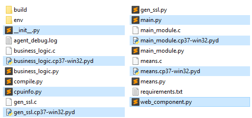
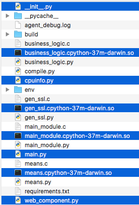
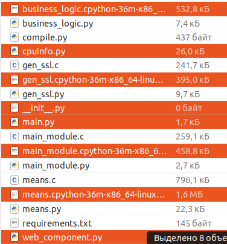
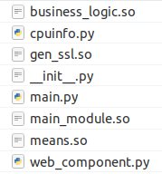
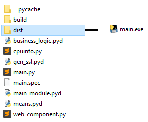
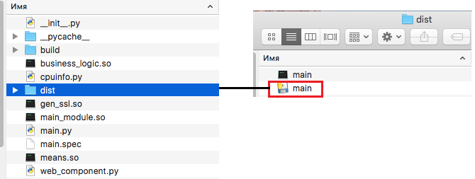
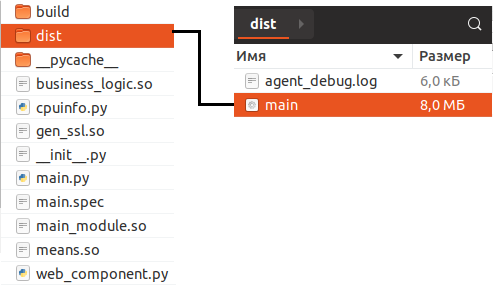

# Инструкция по сборке агента
Для сборки используется python 3.7

Для начала необходимо все файлы исходного кода преобразовать в библиотеки cython.

## Создание библиотек с помощью Cython
1. Установить необходимые зависимости с помощью менеджера pip:

    Windows:
    ```
    pip install websockets netifaces cryptography cython wmi pywin32
    ```
    Mac OS/Linux
    ```
    pip install websockets netifaces cryptography cython

    ```
2. В корне проекта лежит файл compile.py, в котором указаны имена модулей, который будут преобразованы в библиотеку:
    ```
    from distutils.core import setup
    from distutils.extension import Extension
    from Cython.Distutils import build_ext

    ext_modules = [
        Extension("business_logic", ["business_logic.py"]),
        Extension("cpuinfo", ["cpuinfo.py"]),
        Extension("main_module", ["main_module.py"]),
        Extension("means", ["means.py"]),
        Extension("gen_ssl", ["gen_ssl.py"])
        ]

    setup(
        name = 'Agent',
        cmdclass = {'build_ext': build_ext},
        ext_modules = ext_modules
    )
    ```
3. Выполнить команду для запуска процесса преобразования:
    ```
    python compile.py build_ext --inplace
    ```
В итоге рядом с каждым файлом, который участвовал в процессе преобразования, будет создан файл с расширением .pyd (Windows), .so (Mac OS, Linux)

## Компиляция в Pyinstaller в один исполняемый файл
1. Файлы, выделенные на скриншоте, необходимо переместить в новую директорию либо удалить все файлы, кроме выделенных.

    Windows

    

    Mac OS

    

    Linux

    


2. Удалить из названия файлов лишние компоненты. Должно быть вот так:

    

3. Установить pyinstaller, если он еще не установлен:
```
    pip install pyinstaller
```
4. Выполнить команду:
```
    pyinstaller main.py --onefile --noconsole
```
В результате будет создан каталог dist, в котором будет лежать исполняемый файл:

Windows



Mac OS




Linux




## Тестирование

Перед запуском агента необходимо добавить в файл hosts следующую строку:
```
127.0.0.1       srv158026.hoster-test.ru
```

Запустить файл main.


Перейти на сайт:
```
https://infrom-sec.blogspot.com
```
Нажимать на кнопки для отправки запросов и получения ответов от агента.